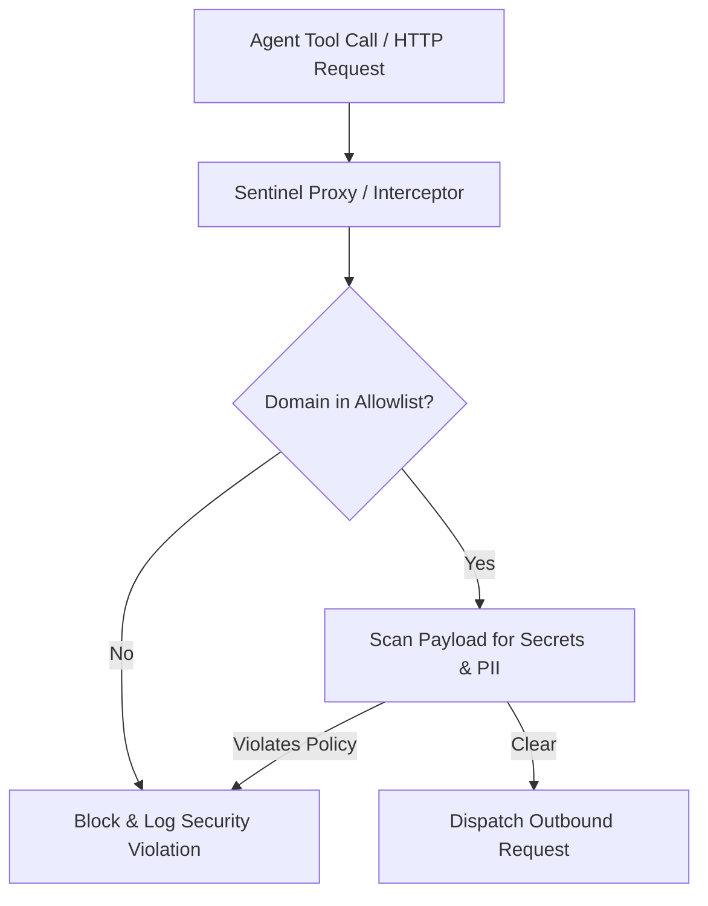

# Sentinel

Continuous Runtime Guard & Egress Filter. Sentinel secures the agent execution environment by implementing real-time network filtering, outbound traffic allowlisting, and semantic payload scanning before data exits the boundary.

## Golden Rules
1. **Deny by default**: All outbound network requests must be blocked unless explicitly allowlisted by destination domain or IP range.
2. **Scan egress payloads**: Scan all tool outputs and API requests for secrets, API keys, and PII (Personally Identifiable Information) before dispatching them.
3. **No-bypass interception**: Hook into network transports at the low-level application engine layer (e.g., overriding global `fetch`, proxying via HTTPS, or using microVM egress rules).
4. **Graceful fail**: When an egress violation occurs, block the request, log a security audit trail, and raise a clean security exception to the agent without crashing the sandbox.

## Security Architecture


## Implementation Frameworks & Tooling
* **TypeScript/JavaScript**: Implement egress filtering using libraries like `agentguard` to intercept global `fetch()` calls, and `llm-guard` for runtime semantic validation.
* **Network Proxying**: Integrate with `oag` (Open Agent Gateway) for a dedicated HTTPS proxy policy and audit layer.
* **Isolation Layer**: Deploy within Firecracker microVMs or sandboxes with network namespaces enforcing egress restrictions at the container level.

## Usage Guide
Define security policies dynamically before starting agent tasks:
```javascript
import { SentinelFirewall } from 'sentinel';

// Initialize egress rules
const sentinel = new SentinelFirewall({
  allowlist: ['github.com', 'api.github.com', 'registry.npmjs.org'],
  scanPII: true,
  scanSecrets: true
});

sentinel.activate(); // Overrides global network handlers
```
